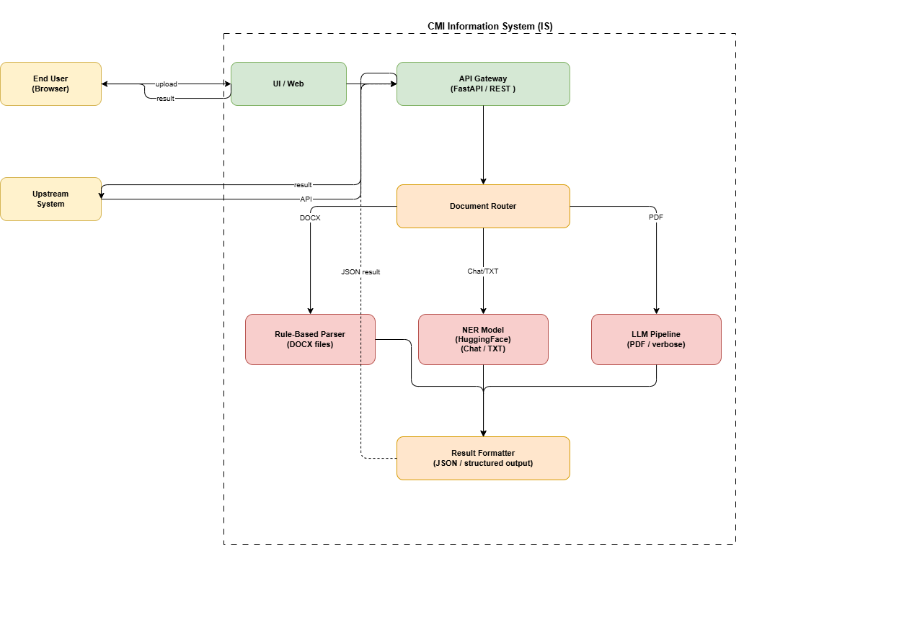

# Global Architecture Document (GAD)
## ADOR — Augmented Document Reader

---

## 1. Context & Objectives

The **ADOR** (Augmented Document Reader) is an AI-powered financial document processing platform. It enables end users and downstream systems to upload financial documents (chats, DOCX term sheets, PDF prospectuses) and automatically extract structured information through five features:

| Feature | Description |
|---|---|
| Classification | Categorise the document type (term sheet, prospectus, chat…) |
| Summarization | Generate a concise executive summary |
| Topic Modelling | Discover latent financial topics (rates, equity, credit…) |
| **NER** | Extract named financial entities (counterparty, notional, ISIN…) |
| Q&A | Answer free-form questions about the document |


---

## 2. High-Level Architecture




## 3. Component Descriptions

### 3.1 User Interface (UI)
- **Technology**: React hosted on an internal web server
- **Responsibilities**:
  - Document upload (drag & drop, multi-format)
  - Feature selection (classification, summarization, NER, Q&A…)
  - Display of structured extraction results
  - Document history and audit trail
- **Security**: SSO/OAuth2, role-based access, TLS in transit

### 3.2 API Gateway
- **Technology**: FastAPI (Python)
- **Endpoints**:
  - `POST /upload` — upload a document (returns a `doc_id`)
  - `POST /extract/ner` — trigger NER on a `doc_id`
  - `GET /results/{doc_id}` — poll results

### 3.3 Document Router
- Detects document **format** (MIME type + extension)
- Routes to the appropriate extraction engine:

| Document Type | Size / Complexity | Engine |
|---|---|---|
| DOCX (structured term sheet) | Small–Medium | Rule-Based Parser |
| TXT / Chat transcript | Short | NER Model |
| PDF (prospectus, verbose) | Medium–Large | LLM Pipeline |

### 3.4 Rule-Based Parser (DOCX)
- **Technology**: `python-docx`
- Traverses tables and paragraphs in DOCX files
- Extracts entities via keyword lookup 

### 3.5 NER Model (Chat / TXT)
- **Technology**: HuggingFace Transformer [BERT]
- Fine-tuned on financial entity labels
- Entities: `COUNTERPARTY`, `NOTIONAL`, `ISIN`, `UNDERLYING`, `MATURITY`, `BID`, `OFFER`, `PAYMENT_FREQUENCY`

### 3.6 LLM Pipeline (PDF / Verbose documents)
- **Technology**: open-source LLM (Mistral, LLaMA)
- **Techniques**: Prompt engineering fir short documents +  RAG (Retrieval-Augmented Generation) for longer ones.
- Chunks large documents, embeds in a vector store, retrieves relevant passages
- Prompts the LLM to extract entities from retrieved context
- Returns structured JSON via function calling or constrained decoding

### 3.7 Result Formatter
- Normalises all engine outputs to a **unified JSON schema**:
```json
{
  "doc_id": "abc123",
  "doc_type": "term_sheet",
  "engine": "rule_based_parser",
  "entities": {
    "Counterparty": "BANK ABC",
    "Notional": "EUR 1 million",
    "InitialValuationDate": "31 January 2025",
    "Maturity": "07 August 2026",
    "Underlying": "Allianz SE (ISIN DE0008404005)",
    "Coupon": "0%",
    "Barrier": "75.00% of Share",
    "Calendar": "TARGET"
  }
}
```

## 4. Communication Modes

| Mode | Use Case | Mechanism |
|---|---|---|
| **Synchronous** | Small documents, fast engines | 
| **Asynchronous** | Large PDFs, LLM pipelines | 

---


## 6. Scalability & Deployment

- All components containerised with **Docker**
- Orchestrated via **Kubernetes** for horizontal scaling

---

## 7. Technology Summary

| Layer | Technology |
|---|---|
| Frontend | React |
| API | FastAPI (Python 3.10+) |
| Rule-Based Parser | python-docx,  |
| NER Model | HuggingFace Transformers  |
| LLM Pipeline | Open source LLM |
| Vector Store | ChromaDB / Pinecone |
| Infrastructure | Docker + Kubernetes |
